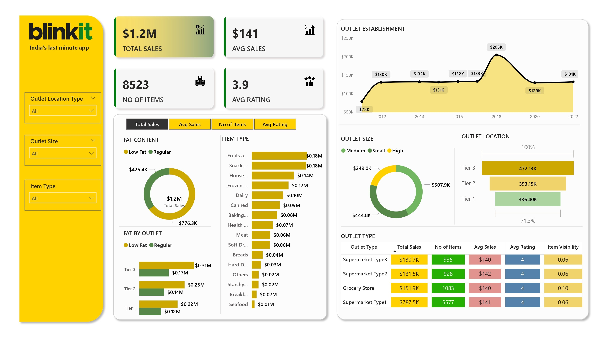

# Blinkit Sales Analytics Dashboard

**A comprehensive Power BI dashboard for analyzing Blinkit's sales performance, outlet metrics, and business intelligence**


## Dashboard Overview



## Project Description

This Power BI dashboard provides comprehensive analytics for Blinkit, India's leading last-minute delivery application. The dashboard offers detailed insights into sales performance, inventory management, outlet analytics, and customer satisfaction metrics, enabling data-driven decision making through interactive visualizations and key performance indicators.

## Key Features

### Sales Analytics
- **Total Sales**: $1.2M revenue tracking across all outlets
- **Average Sales**: $141 per transaction analysis
- **Historical Performance**: Sales trends spanning from 2012 to 2022
- **Revenue Distribution**: Analysis by item type, outlet size, and geographic location

### Outlet Performance Metrics
- **Inventory Management**: 8,523 items across multiple product categories
- **Establishment Timeline**: Growth tracking over 10+ years of operations
- **Geographic Analysis**: Performance comparison across Tier 1, 2, and 3 cities
- **Size Segmentation**: Analysis by small, medium, and large outlet categories

### Customer Satisfaction Analysis
- **Average Rating**: 3.9 out of 5.0 customer satisfaction score
- **Product Visibility**: Individual item performance metrics
- **Category Performance**: Detailed breakdown by product classifications

### Product Portfolio Analysis
- Fruits and Vegetables: $0.18M (highest performing category)
- Snack Foods: $0.18M 
- Household Items: $0.14M
- Frozen Foods: $0.12M
- Dairy Products: $0.10M
- Additional 10+ product categories with detailed analytics

## Dashboard Components

### Primary KPI Cards
- Total Sales Revenue
- Average Sales per Transaction
- Total Number of Items
- Average Customer Rating

### Interactive Visualizations

1. **Fat Content Analysis**: Performance comparison between low-fat and regular products
2. **Item Type Revenue Breakdown**: Horizontal bar chart displaying revenue by product category
3. **Outlet Establishment Timeline**: Area chart showing historical growth trends
4. **Outlet Size Distribution**: Donut chart with size-based performance segmentation
5. **Geographic Performance Analysis**: Tier-wise analysis with comprehensive metrics
6. **Outlet Type Comparison**: Detailed performance table with multiple metrics

### Filtering Capabilities
- Outlet Location Type selection
- Outlet Size categorization
- Item Type filtering
- Custom date range selection

## Technical Specifications

- **Primary Platform**: Microsoft Power BI Desktop
- **Data Sources**: Blinkit sales and operational databases
- **Visualization Engine**: Interactive charts and analytical graphs
- **File Format**: .pbix (Power BI Project file)
- **Data Refresh**: Automated daily updates
- **Compatibility**: Power BI Desktop 2023 or later

## Repository Structure

```
blinkit-powerbi-dashboard/
│
├── README.md
├── Blinkit_Dashboard.pbix
├── screenshots/
│   └── Blinkit_page-0001.jpg
├── data/
│   ├── sales_data.csv
│   ├── outlet_data.csv
│   └── product_catalog.csv
├── documentation/
│   ├── data_dictionary.md
│   ├── kpi_definitions.md
│   └── user_guide.pdf
└── resources/
    ├── color_palette.txt
    └── brand_guidelines.md
```

## Installation and Setup

### Prerequisites
- Microsoft Power BI Desktop (latest stable version)
- Access to Blinkit operational data
- Basic understanding of Power BI functionality and data modeling

### Installation Steps

1. **Repository Clone**
   ```bash
   git clone https://github.com/yourusername/blinkit-powerbi-dashboard.git
   cd blinkit-powerbi-dashboard
   ```

2. **Power BI Configuration**
   - Launch Microsoft Power BI Desktop
   - Open the file `Blinkit_Dashboard.pbix`
   - Configure data source connections as required
   - Refresh data connections to ensure current data

3. **Data Source Configuration**
   - Update data source connection strings
   - Verify scheduled refresh settings
   - Test all visualizations for proper functionality

## Key Performance Indicators

| Metric | Description | Current Value | Trend |
|--------|-------------|---------------|-------|
| Total Sales | Overall revenue generated across all outlets | $1.2M | Positive |
| Average Sales | Mean transaction value per sale | $141 | Stable |
| Total Items | Number of products sold | 8,523 | Growing |
| Customer Rating | Average satisfaction score | 3.9/5 | Improving |
| Top Category | Highest performing product segment | Fruits & Vegetables | Consistent |
| Peak Establishment Year | Highest growth period | 2018 ($205K) | Historical |

## Business Intelligence Applications

### Executive Reporting
- High-level KPI monitoring for senior management
- Strategic decision support through data visualization
- Performance benchmarking across outlet networks

### Sales Analysis
- Revenue trend identification and forecasting
- Product performance optimization
- Market segment analysis

### Operational Management
- Outlet performance comparison and ranking
- Inventory management optimization
- Geographic expansion planning

### Strategic Planning
- Category-wise sales insights for product strategy
- Location-based performance for expansion decisions
- Customer satisfaction tracking for service improvement

## Data Refresh and Maintenance

- **Update Frequency**: Daily automated refresh (recommended)
- **Data Sources**: Integrated automated data pipeline
- **Backup Schedule**: Weekly full data refresh
- **Monitoring**: Automated alert system for data inconsistencies
- **Quality Assurance**: Monthly data validation procedures

## Contributing Guidelines

Contributions to improve this dashboard are welcome. Please follow these procedures:

1. Fork the repository to your GitHub account
2. Create a feature branch (`git checkout -b feature/enhancement-name`)
3. Implement your changes with proper documentation
4. Commit changes with descriptive messages (`git commit -m 'Add enhancement description'`)
5. Push to your feature branch (`git push origin feature/enhancement-name`)
6. Submit a Pull Request with detailed description of changes

### Development Standards
- Follow existing naming conventions throughout the project
- Document all new features and modifications
- Test all visualizations thoroughly before submission
- Ensure data connections function properly across environments
- Maintain consistency with existing design patterns

## Version History

### Version 1.0 (Current Release)
- Initial dashboard creation with core functionality
- Implementation of primary KPI tracking system
- Development of interactive filtering capabilities
- Creation of multi-dimensional analysis views
- Integration of historical data from 2012-2022

### Planned Enhancements
- Real-time data integration capabilities
- Advanced predictive analytics and forecasting models
- Mobile-optimized responsive design
- Extended product category analysis
- Enhanced user interaction features
- Automated report generation functionality

## License

This project is licensed under the MIT License. See the [LICENSE.md](LICENSE.md) file for complete license terms and conditions.

## Acknowledgments

- Blinkit development team for providing comprehensive operational data
- Power BI community for visualization best practices and inspiration
- Open source contributors who provided feedback and enhancements
- Academic institutions supporting business intelligence research

---

**For technical support or questions regarding this dashboard, please refer to the documentation or submit an issue through the GitHub repository.**
