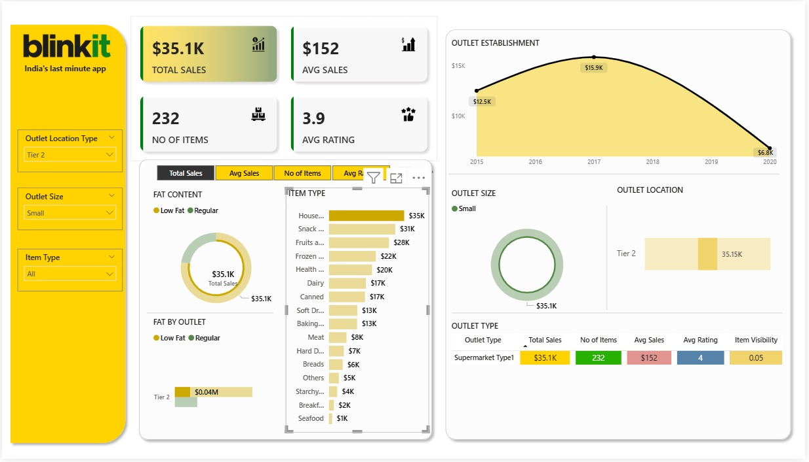

# Blinkit Sales Analytics Dashboard

**A comprehensive Power BI dashboard for analyzing Blinkit's sales performance, outlet metrics, and business intelligence across multiple market tiers**


## Dashboard Overview

This Power BI dashboard provides comprehensive analytics for Blinkit, India's leading last-minute delivery application. The dashboard features interactive filtering capabilities that allow users to analyze performance across different market tiers and outlet configurations.

### Complete Dashboard View (All Markets)
<div align="center">
  
  <p><em>Complete dashboard showing consolidated performance across all market tiers</em></p>
</div>

**Key Metrics (All Markets):**
- Total Sales: $1.2M
- Average Sales: $141
- Total Items: 8,523
- Customer Rating: 3.9/5

### Tier 1 Market Analysis
<div align="center">
  
  <p><em>Dashboard filtered for Tier 1 market performance analysis</em></p>
</div>

**Tier 1 Performance Metrics:**
- Total Sales: $50.1K
- Average Sales: $149
- Total Items: 337
- Customer Rating: 3.9/5
- Market Focus: Premium urban centers with higher transaction values

### Tier 2 Market Analysis
<div align="center">
  
  <p><em>Dashboard filtered for Tier 2 market performance analysis</em></p>
</div>

**Tier 2 Performance Metrics:**
- Total Sales: $35.1K
- Average Sales: $152 (highest average transaction value)
- Total Items: 232
- Customer Rating: 3.9/5
- Market Focus: Secondary cities with optimized transaction efficiency

## Project Description

This Power BI dashboard provides comprehensive analytics for Blinkit's multi-tier market strategy. The dashboard offers detailed insights into sales performance, inventory management, outlet analytics, and customer satisfaction metrics across different market segments, enabling data-driven decision making through interactive visualizations and key performance indicators.

## Key Features

### Interactive Market Segmentation
- **Multi-Tier Analysis**: Performance comparison across Tier 1, Tier 2, and Tier 3 markets
- **Dynamic Filtering**: Real-time data segmentation by location type, outlet size, and item categories
- **Comparative Analytics**: Side-by-side performance analysis across different market segments

### Sales Performance Analytics
- **Consolidated Sales Tracking**: $1.2M total revenue across all markets
- **Market-Specific Analysis**: Individual tier performance tracking
- **Transaction Value Analysis**: Average sales ranging from $141-$152 across tiers
- **Historical Trends**: Time-series analysis from 2012-2022

### Market Tier Insights
#### Tier 1 Markets (Premium Urban Centers)
- Sales Volume: $50.1K (focused on high-value urban markets)
- Product Range: 337 items (curated premium selection)
- Transaction Value: $149 average (premium customer base)
- Market Strategy: Quality-focused approach with premium positioning

#### Tier 2 Markets (Secondary Cities)
- Sales Volume: $35.1K (efficient secondary market penetration)
- Product Range: 232 items (optimized product mix)
- Transaction Value: $152 average (highest efficiency per transaction)
- Market Strategy: Value-optimized operations with high transaction efficiency

#### Comprehensive Market View
- Total Market Coverage: All tier consolidation
- Complete Product Portfolio: 8,523 total items
- Market Penetration: Full geographic coverage analysis
- Strategic Overview: Complete business intelligence perspective

### Product Category Performance
#### Cross-Tier Category Analysis
- **Fruits and Vegetables**: Consistent top performer across all tiers
- **Snack Foods**: Strong performance in urban markets (Tier 1)
- **Household Items**: Steady demand across all market segments
- **Frozen Foods**: Market-specific preferences and performance
- **Dairy Products**: Essential category with consistent demand

### Outlet Performance Metrics
- **Size-Based Analysis**: Small, medium, and large outlet performance
- **Geographic Distribution**: Market tier-specific outlet strategies
- **Establishment Timeline**: Growth patterns across different markets
- **Performance Benchmarking**: Comparative analysis across outlet types

## Dashboard Components

### Primary KPI Dashboard Cards
- **Total Sales Revenue**: Market-specific and consolidated views
- **Average Transaction Value**: Tier-wise comparison capabilities
- **Product Portfolio Size**: Market-optimized inventory analysis
- **Customer Satisfaction**: Consistent 3.9/5 rating across all tiers

### Interactive Visualizations

1. **Market Tier Selection Filter**: Dynamic switching between Tier 1, Tier 2, and All markets
2. **Fat Content Analysis**: Low-fat vs regular product performance by market
3. **Product Category Revenue Breakdown**: Market-specific category performance
4. **Outlet Establishment Timeline**: Historical growth analysis by tier
5. **Geographic Performance Mapping**: Tier-wise sales distribution
6. **Outlet Type Comparative Analysis**: Performance metrics by outlet classification

### Advanced Filtering Capabilities
- **Market Tier Selection**: Tier 1, Tier 2, Tier 3, or All markets
- **Outlet Size Filtering**: Small, medium, large outlet analysis
- **Product Category Selection**: Item type-specific analysis
- **Time Period Selection**: Historical trend analysis
- **Outlet Location Type**: Geographic performance segmentation

## Technical Specifications

- **Platform**: Microsoft Power BI Desktop
- **Data Integration**: Multi-source data consolidation across market tiers
- **Visualization Engine**: Interactive charts with real-time filtering
- **File Format**: .pbix (Power BI Project file)
- **Data Refresh**: Automated daily updates across all market segments
- **Performance Optimization**: Optimized for large-scale multi-tier data analysis

## Repository Structure

```
blinkit-powerbi-dashboard/
│
├── README.md
├── Blinkit_Dashboard.pbix
├── Blinkit_page-0001.jpg          # Complete dashboard view
├── dashboard_tier1.jpg            # Tier 1 market view
├── dashboard_tier2.jpg            # Tier 2 market view
├── data/
│   ├── consolidated_sales_data.csv
│   ├── tier1_market_data.csv
│   ├── tier2_market_data.csv
│   ├── tier3_market_data.csv
│   └── outlet_geographic_data.csv
├── documentation/
│   ├── market_tier_definitions.md
│   ├── kpi_calculations.md
│   ├── filtering_guide.md
│   └── user_manual.pdf
└── analysis/
    ├── tier_comparison_report.pdf
    ├── market_penetration_analysis.xlsx
    └── performance_benchmarks.csv
```

## Market Tier Analysis

### Comparative Performance Overview

| Market Tier | Total Sales | Avg Sales | Items | Rating | Market Strategy |
|-------------|-------------|-----------|-------|---------|-----------------|
| **All Markets** | $1.2M | $141 | 8,523 | 3.9/5 | Complete portfolio coverage |
| **Tier 1** | $50.1K | $149 | 337 | 3.9/5 | Premium urban focus |
| **Tier 2** | $35.1K | $152 | 232 | 3.9/5 | Efficiency optimization |

### Key Performance Insights

#### Transaction Value Analysis
- **Tier 2 Leadership**: Highest average transaction value at $152
- **Tier 1 Premium**: Strong $149 average reflecting urban premium positioning
- **Overall Market**: Balanced $141 average across all segments

#### Product Portfolio Strategy
- **Tier 1**: 337 items (premium curated selection)
- **Tier 2**: 232 items (efficiency-optimized portfolio)
- **Complete Portfolio**: 8,523 total items (comprehensive market coverage)

#### Customer Satisfaction Consistency
- **Universal Excellence**: 3.9/5 rating maintained across all market tiers
- **Service Standardization**: Consistent quality delivery across markets
- **Brand Reliability**: Strong customer satisfaction regardless of market segment

## Business Intelligence Applications

### Strategic Market Planning
- **Tier-Specific Strategy Development**: Data-driven market approach optimization
- **Resource Allocation**: Performance-based investment decisions across tiers
- **Expansion Planning**: Market penetration analysis for new tier development

### Operational Excellence
- **Inventory Optimization**: Market-specific product portfolio management
- **Performance Benchmarking**: Cross-tier comparative analysis
- **Efficiency Tracking**: Transaction value optimization across markets

### Executive Reporting
- **Multi-Tier Dashboard**: Comprehensive executive overview capabilities
- **Market Performance Tracking**: Real-time tier-specific KPI monitoring
- **Strategic Decision Support**: Data-driven market strategy development

## Installation and Setup

### Prerequisites
- Microsoft Power BI Desktop (latest version)
- Multi-tier market data access
- Geographic market segmentation understanding
- Power BI filtering and visualization experience

### Setup Instructions

1. **Repository Setup**
   ```bash
   git clone https://github.com/yourusername/blinkit-powerbi-dashboard.git
   cd blinkit-powerbi-dashboard
   ```

2. **Power BI Configuration**
   - Open `Blinkit_Dashboard.pbix` in Power BI Desktop
   - Configure multi-tier data source connections
   - Verify market segmentation filters functionality
   - Test cross-tier comparative analysis features

3. **Data Integration**
   - Validate market tier data connectivity
   - Configure automated refresh for all market segments
   - Test filtering functionality across all tiers
   - Verify calculation accuracy for consolidated views

## Usage Guidelines

### Dashboard Navigation
1. **Market Selection**: Use Outlet Location Type filter to select specific tiers
2. **Comparative Analysis**: Switch between "All" view and specific tiers for comparison
3. **Deep Dive Analysis**: Utilize additional filters for granular insights
4. **Export Capabilities**: Generate tier-specific reports as needed

### Best Practices
- **Start with Overview**: Begin analysis with "All" markets view
- **Tier Comparison**: Use individual tier views for specific market insights
- **Filter Combination**: Combine multiple filters for advanced analysis
- **Regular Refresh**: Ensure data currency across all market segments

## Contributing Guidelines

Contributions to enhance this multi-tier dashboard are welcome:

1. Fork the repository
2. Create feature branch for market-specific enhancements
3. Test across all market tier views
4. Submit pull request with comprehensive testing documentation
5. Ensure compatibility with existing filtering mechanisms

## License

This project is licensed under the MIT License - see [LICENSE.md](LICENSE.md) for details.

## Acknowledgments

- Blinkit analytics team for comprehensive multi-tier market data
- Power BI community for advanced filtering and visualization techniques
- Market research teams for tier-specific insights and validation
- Business intelligence professionals for dashboard optimization guidance

---

**This dashboard demonstrates advanced Power BI capabilities in multi-tier market analysis and interactive business intelligence visualization.**
